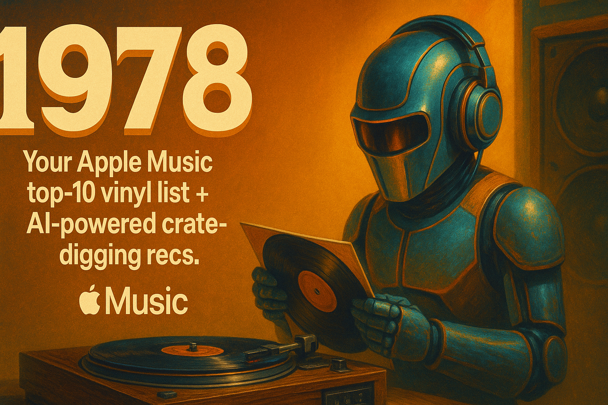

  

  
  
  
  
  

<h1 align="center">🎧 1978 — Your Personal Top‑10 Vinyl Picks</h1>

  <i>An AI-powered music nostalgia engine by AJ Ricardo.</i>

  
  
  

---

**1978** is a Python app that analyzes your Apple Music library, generates your **Top 10 played albums**, then asks AI to suggest **crate-digger picks** you’ll probably love. Export as a printable list for your vinyl adventures.

---

## 🛠️ How It Works

1. Export your Apple Music Library XML  
2. Run `library_parser.py`  
3. Then run `vinyl_ai.py` — it uses OpenAI to suggest a personalized vinyl starter kit  
4. Get a print-ready Markdown list of 10 records: 5 real, 5 AI-picked

---

  

