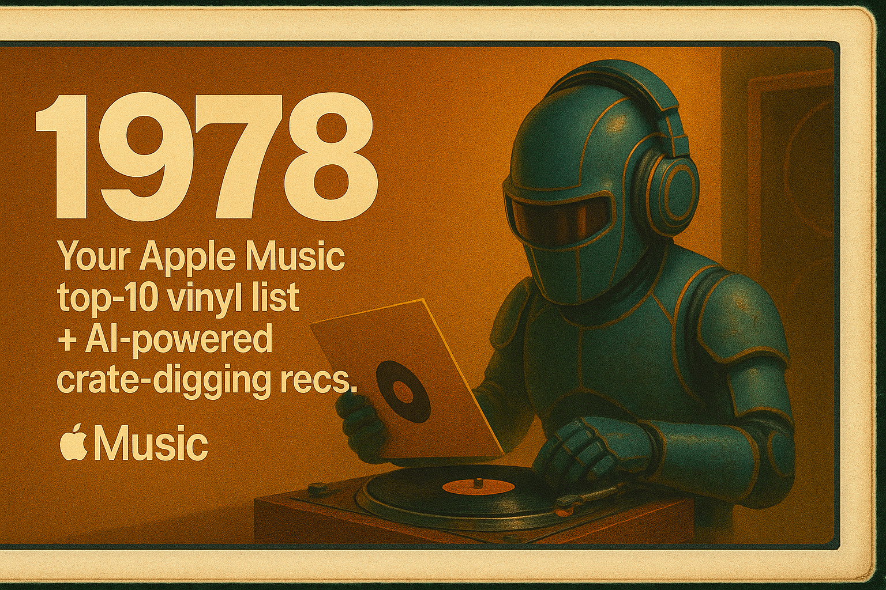

<p align="center">
  
</p>

<p align="center">
  
  
  
  
  
</p>

<h1 align="center">1978 — Your Personal Top‑10 Vinyl Picks</h1>

<p align="center">
  <i>A lovingly crafted, AI-powered album recommendation tool from AJ Ricardo.</i>
</p>

---

**1978** is a Python-based toolkit that turns your Apple Music listening history into a personalized vinyl crate starter kit — with **AI-recommended picks** you probably don’t own yet.

This repo does two things:

1. 🚀 **`library_parser.py`** — Parses your exported `Library.xml` and builds `top10_real.json` from your most-played albums.
2. 🤖 **`vinyl_ai.py`** — Prompts OpenAI to generate 5 vinyl crate-digger albums that match your taste but go beyond your Top 10 — styled as a Markdown flyer.

> _Named ‘1978’ for the peak era of vinyl record sales, when music was tactile, personal… and perfect._

---

## 🔧 Setup & Usage

### 1. Export your Apple Music Library  
Use Music.app:  
**File → Library → Export Library…**  
This generates `Library.xml`.

Or use [`music-library-exporter`](https://github.com/mirko-leccese/Apple-Music-Library-Analysis) for automated export.

### 2. Parse your library

```bash
python3 library_parser.py /path/to/Library.xml